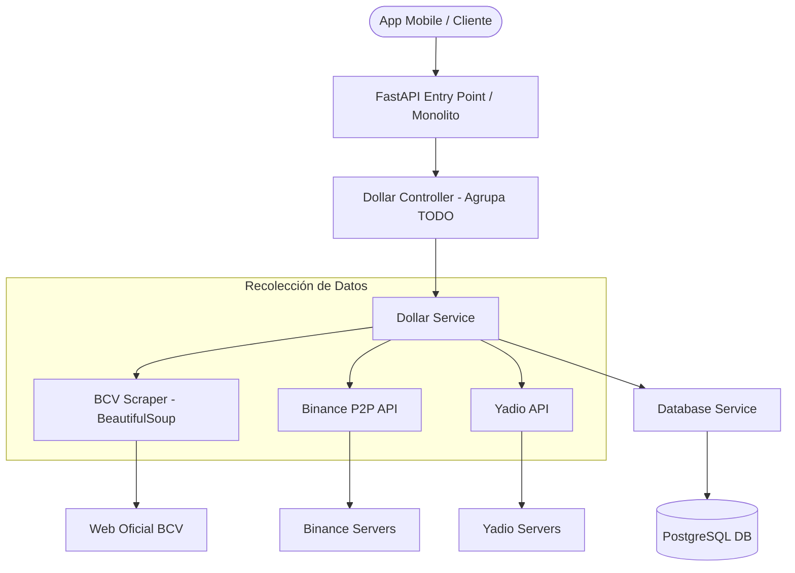
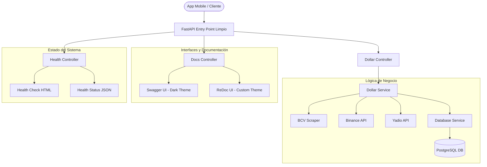

# Release Notes - v1.1.1 🚀
**DolarTracker Backend: The Professionalization Update**
*Fecha de lanzamiento: 15 de Abril de 2026*

---

## 💎 Visión General
La versión **1.1.1** representa una transformación significativa en la madurez del proyecto. No solo se han optimizado los procesos internos, sino que se ha dotado a la API de una identidad visual premium y una arquitectura modular que facilita su escalabilidad y mantenimiento a largo plazo.

---

## 🏛️ Evolución de la Arquitectura

### Comparativa de Características
| Característica | Arquitectura Anterior (Pre-v1.1.1) | Arquitectura Actual (v1.1.1) |
| :--- | :--- | :--- |
| **Estructura del Main** | Monolítica. Rutas, lógica y metadatos mezclados. | Desacoplada. Uso intensivo de `APIRouter`. |
| **Documentación** | Swagger/ReDoc estándar (fondo blanco). | Temas Dark Mode Premium personalizados. |
| **Gestión de Recursos** | Rutas de archivos estáticos en el `main.py`. | Controlador dedicado (`docs_controller.py`). |
| **Monitoreo** | No disponible o respuesta simple de texto. | Visual Health Check con interfaz dedicada y animación. |
| **Identidad de Marca** | Sin logotipos ni favicon. | Logo SVG y Favicon inyectados en toda la UI. |

### Diagramas de Arquitectura (Mermaid)

#### Antes (Pre-v1.1.1)

#### Actual (v1.1.1 Modularizada)

---

## 🛠️ Registro de Cambios (Desde 14 de Abril)

### 🎨 Experiencia de Usuario y UI/UX
*   **Custom ReDoc Dark Theme**: Implementación de una interfaz de documentación oscura ultra-limpia basada en la paleta de colores de `themeV2.json`.
*   **Custom Swagger UI**: Refactorización profunda de Swagger mediante inyección de CSS para mantener coherencia visual con la marca.
*   **Identidad Visual**: Integración de `logo_center.svg` y `favicon.ico` en todas las herramientas de la API.
*   **Página Raíz Dinámica**: Mejora del endpoint `/` para actuar como un portal de bienvenida con accesos directos.

### ⚙️ Mejoras de Ingeniería y Estructura
*   **Modularización de Controladores**: Se crearon `docs_controller.py` y `health_controller.py` para limpiar el punto de entrada de la app.
*   **Sistema de Salud (Health Check)**: Creación de un endpoint `/health` (JSON) y `/health/ui` (Visual) para monitoreo de uptime.
*   **Vercel Optimization**: Ajustes de configuración para despliegues fluidos en la nube.
*   **Git Hygiene**: Optimización de `.gitignore` para entornos virtuales y limpieza de archivos de sistema.

### 📝 Documentación y Legal
*   **Licencia MIT**: Adición formal de la licencia de código abierto.
*   **Guías de Contribución**: Implementación de políticas de desarrollo para colaboradores externos.

---

## 📸 Comparativa Visual (Side-by-Side)

A continuación se muestra la evolución estética desde la versión inicial hasta la actual v1.1.1:

### 🏠 Landing Page (Root)
| Antes (v1.0.0) | Después (v1.1.1) |
| :---: | :---: |
| _(captura previa disponible en el portal `/` desplegado)_ | _(captura actual disponible en el portal `/` desplegado)_ |

### 📄 Documentación Ténica (ReDoc)
| Antes (v1.1.0) | Después (v1.1.1) |
| :---: | :---: |
|  |  |
---

## 🚀 Próximos Pasos
*   Implementación de caché avanzada para endpoints de scraping.
*   Integración de autenticación JWT para endpoints administrativos.
*   Dashboard estadístico de variaciones históricas.

---
*DolarTracker - Monitorizando la economía con precisión y elegancia.*
